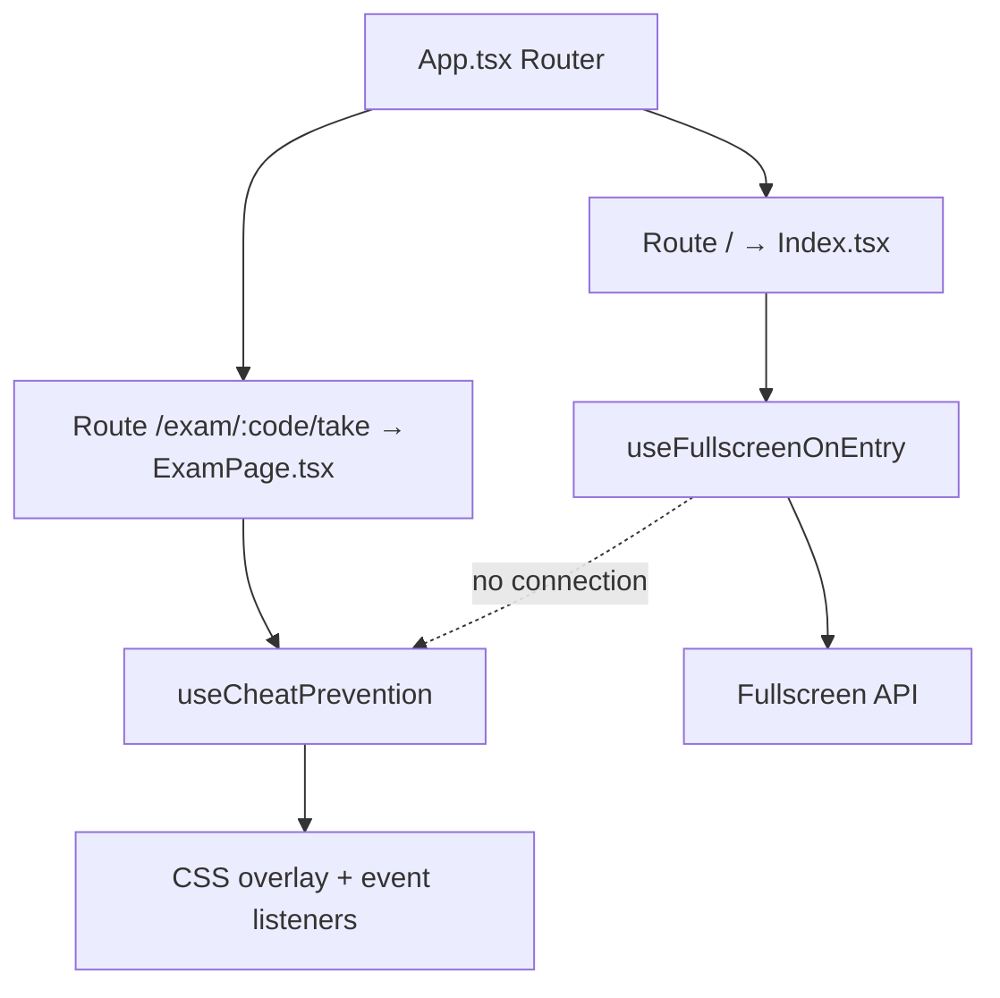

# Design Document: landing-page-fullscreen

## Overview

This feature has two concerns that are intentionally kept separate:

1. **Landing Page formalisation** — `Index.tsx` at route `/` is the official site entry point. It already exists and is fully implemented; this spec validates and documents it as the canonical landing page.

2. **Auto-fullscreen on entry** — `useFullscreenOnEntry`, a custom React hook, requests browser fullscreen when the landing page mounts. The hook already exists at `src/hooks/useFullscreenOnEntry.ts`. This spec formalises its contract, constraints, and integration point.

The two concerns share a single integration point: `Index.tsx` calls `useFullscreenOnEntry()`. Everything else is independent.

---

## Architecture

The feature touches three layers:

```
App.tsx (router)
  └── Route path="/"  →  Index.tsx  (landing page)
                              └── useFullscreenOnEntry()  (hook)
                                      └── document.documentElement.requestFullscreen()
```

Exam flow pages (`StudentAccess`, `ExamReady`, `ExamPage`, `ExamComplete`) are completely separate branches of the router and have no connection to `useFullscreenOnEntry`. `ExamPage` uses `useCheatPrevention`, which is entirely independent.



---

## Components and Interfaces

### useFullscreenOnEntry (existing, src/hooks/useFullscreenOnEntry.ts)

```ts
export function useFullscreenOnEntry(): void
```

Behaviour contract:
- Runs once on mount via `useEffect(fn, [])`.
- Guards with `if (document.fullscreenElement) return` — skips if already fullscreen.
- Calls `document.documentElement.requestFullscreen({ navigationUI: "hide" })`.
- Catches any rejection silently (`.catch(() => {})`).
- Returns nothing; has no state, no props, no cleanup needed.

The existing implementation should also guard against browsers where `requestFullscreen` is undefined (Requirement 2.6). The updated guard:

```ts
if (document.fullscreenElement) return;
if (!document.documentElement.requestFullscreen) return;
document.documentElement.requestFullscreen({ navigationUI: "hide" }).catch(() => {});
```

### Index.tsx (existing, src/pages/Index.tsx)

The landing page component. Integration point: call `useFullscreenOnEntry()` at the top of the component body alongside existing `useState` hooks. No other changes to the component are required.

```tsx
const Index = () => {
  useFullscreenOnEntry(); // <-- add this line
  const navigate = useNavigate();
  // ...rest unchanged
};
```

### useCheatPrevention (existing, src/hooks/useCheatPrevention.ts)

Not modified. Used exclusively in `ExamPage.tsx`. Its source already documents that it does not use the browser Fullscreen API — it uses a CSS overlay instead. `useFullscreenOnEntry` must never import or reference this hook.

---

## Data Models

This feature introduces no new data models, database tables, or persistent state. The only runtime state is:

- `document.fullscreenElement` — a browser-native read-only property consulted by the hook guard.
- `fsEntered` — a local `boolean` state already in `Index.tsx` that controls the click-to-enter overlay.

---
